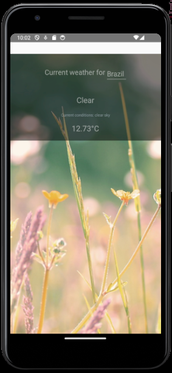

## Weather App - using React Native

### Description:  
This is a weather application developed with the help of React Native framework in JavaScript, and using OpenWeatherMap API. The project includes functionalities such as displaying current weather information,
which allows users to search for the current and forecasted weather conditions of any city worldwide.
